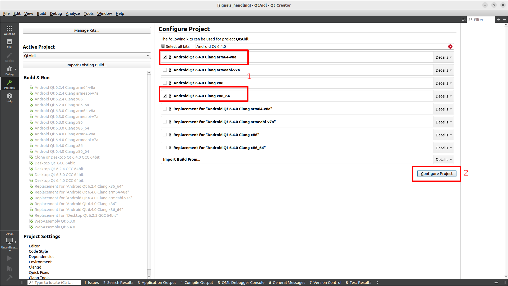

- [About](#about)
  - [The problem to solve](#the-problem-to-solve)
  - [The solution we propose](#the-solution-we-propose)
  - [QtAidl Foundation](#qtaidl-foundation)
  - [How it works](#how-it-works)
    - [QFace to AIDL conversion](#qface-to-aidl-conversion)
- [Installing QtAidl module into your Environment](#installing-qtaidl-module-into-your-environment)
  - [Prerequisites](#prerequisites)
  - [Building the QtAidl module](#building-the-qtaidl-module)
- [Example code](#example-code)
  - [StopwatchApp example](#stopwatchapp-example)
    - [Building for host platform](#building-for-host-platform)
    - [Building for android target](#building-for-android-target)
    - [Android variant implementation details](#android-variant-implementation-details)
      - [Backend implementation](#backend-implementation)
      - [Integrating Service into application APK](#integrating-service-into-application-apk)
      - [The service implementation](#the-service-implementation)
      - [Debugging the service code](#debugging-the-service-code)
    - [Modifying Kotlin projects](#modifying-kotlin-projects)
- [The hidden heroes](#the-hidden-heroes)
- [Licenses and Attributions](#licenses-and-attributions)

# About

QtAidl is an experimental extension module for Qt Framework that aims to simplify the work-/data-flow in case of the need to use Android Framework APIs. While Qt framework abstracts the basic Android APIs and makes them seamless for the application developer - Qt Multimedia is a good example of that - it doesn't (and shouldn't) cover other API sets (like e.g. the one ofered by Contacts Provider in case if one would like to build the phone book application.)

## The problem to solve

It means that the effort to integrate such APIs is on the application developer's side. We could summarize the usual data flow that has to be implemented in a simplified form:


It means that whenever we would like to expose some information from Java/Kotlin APIs to QML (or send some feedback from QML back to those APIs) we need to develop the code in 4 languages:
* QML - for our presentation layer
* C++ - to expose the information from business logic layer to QtQuick engine
* C - to cross the boundaries of our Application and JVM
* Java/Kotlin to invoke the appropriate API

For many reasons the above flow might be problematic - just to name a few of them:
* Developer has to produce a lot of boilerplate and repetitive code (especially on the JNI calls level )
* The code is hard to refactor in case of the need to add new features
* The code is error prone
* JNI code doesn't provide strong typing for complex types causing the need to manually extract the data of unknown structures or perform a lot of casts
* As usually the code using Android APIs is located in the same process as UI (e.g. in Activity subclass), any exception in that area will cause the whole application to crash.

## The solution we propose

As already mentioned QtAidl aims to simplify that dataflow with the goal to replace current approach with the following one:


On the above sketch you can see the solution where Application is divided into two layers where QtAidl serves the glue between them:
* Bussines Logic Layer - enclosed in Java/Kotlin only service
* Presentation Layer - providing visual interaction with end user with QML frontends (in fact QtAidl can also be used with any Qt based C++ code).

## QtAidl Foundation

To implement this approach, we have selected two main foundations for QtAidl module:
* [Qt Interface Framework](https://doc.qt.io/QtInterfaceFramework/)
* [Bound Services pattern](https://developer.android.com/guide/components/bound-services)

Qt Interface framework is built around the pattern that separates the feature from actual implementation. What's more, it allows defining or re-defining easily the APIs related to the feature and provides a way automate generation of the code that is needed to use that feature from QML or C++. It also allows creating multiple backends (implementing or abstracting access to the business logic layer) for the same feature (and discover them in runtime) which means that you can develop the application parts in separation e.g. using Simulation Backend or a Backend specific for some platform (e.g. embedded Linux) until the production backend for Android will be ready, and then you can easily make the switchover.

Android Bound Services fits well into that approach. It is using [Binder IPC](https://developer.android.com/reference/android/os/IBinder) to  implement the idiom where the business logic is enclosed in a Service (running in the separate process), while the presentation is using just a handle to that service (Local Proxy Object to be exact) to perform operations on it. As the business logic is separated from the presentation any failure in service won't make the UI process crash.


QtAidl joins those two worlds in the following way:


## How it works

As you can see the need for hand written code is limited only to the:
* UI code (in our case QML)
* Bussines logic (Java or Kotlin)

The rest of the code either comes from SDKs (Qt Interface Framework Core library and Android SKD/NDK) or is auto generated. 

For the needs of code generation:
* Qt Interface Framework is using the [QFace](https://qface.readthedocs.io/en/latest/) IDL
* Android Binder IPC is using [AIDL](https://developer.android.com/guide/components/aidl) language

QtAidl module enables easy transition between both worlds:
* It provides additional (the list of standard Qt Interface framework templates can be found [here](https://doc.qt.io/QtInterfaceFramework/generator-usage.html#frontend-template)) project template - `aidl` - that:
  * generates AIDL files out of QFace IDL file
  * generates the valid Qt Interface Framework backend that wraps Binder IPC
  * generates LocalProxyObject classes using [AIDL NDK Backend](https://source.android.com/docs/core/architecture/aidl/aidl-backends)
  * generates CMake file required to make that part of the dynamic library
* Provides gradle plugin that can be used to repeat QFace -> AIDL conversion on the service end
* Ships small java library that is required to obtain service binder object (at the moment it is not possible to obtain binder using [unmodified NDK](https://issuetracker.google.com/issues/160351035)) and is used by the generated code.

### QFace to AIDL conversion

Currently only a subset of QFace IDL is supported. Support for the following major elements of [QFace grammar](https://qface.readthedocs.io/en/latest/grammar.html) are not implemented yet:
* [Nested Types](https://qface.readthedocs.io/en/latest/grammar.html#nested-types)
* [Enum/Flag](https://qface.readthedocs.io/en/latest/grammar.html#enum-flag)
* `extends` [keyword](https://qface.readthedocs.io/en/latest/grammar.html#interface)

Regarding the conversion rules between QFace IDL and AIDL the QtAidl module takes the following convention:
* [Module](https://qface.readthedocs.io/en/latest/grammar.html#module) becomes [Package](https://source.android.com/docs/core/architecture/aidl/aidl-language#package)
* [Struct](https://qface.readthedocs.io/en/latest/grammar.html#struct) becomes [Parcelable](https://source.android.com/docs/core/architecture/aidl/aidl-language#parcelables) and is resulting in creation of `<StructName>Struct.aidl` file allowing the exchange more complex data
* [Interface](https://qface.readthedocs.io/en/latest/grammar.html#interface) results in creating two AIDL [Interfaces](https://source.android.com/docs/core/architecture/aidl/aidl-language#interfaces) and creates the following files:
  * `I<InterfaceName>Service.aidl`
  * `I<InterfaceName>Callback.aidl`
* `I<InterfaceName>Service` represents the business logic part that QtAidl backend expects to be implemented by the actual android service:
  * it has two extra methods (that are called when backend tries to bind/unbind to/from the service) that are taking the instance of `I<InterfaceName>Callback` interface:
    * `void registerCallback(IStopwatchControllerCallback cb)` the implementing service shall store the reference to `cb` on call to that method for future use
    * `void unregisterCallback(IStopwatchControllerCallback cb)` the implementing service shall not use `cb` any more and shall clear local reference
  * `I<InterfaceName>Callback` provides communication channel from implementing service back to QtAidl backend on application side. It could be treated as a counterpart providing the ability to do the `emit signal` if compared to the Qt world
  * QFace Interface properties rules:
    * All the QFace Interface properties will result in:
      * adding `<PropetyType> <propertyName>()` method to `I<InterfaceName>Service` interface - the implementing service shall return an internally stored value on call to that method
      * adding `void <propertyName>Change(in <PropertyType> <propertyName>)` method to `I<InterfaceName>Callback` interface - the implementing service shall invoke that method on stored `cb` reference whenever internally stored value is changed
    * If property is neither `readonly` nor `const` the following method will be added to `I<InterfaceName>Service` interface:
      * void `set<PopertyName>(in <PropertyType> <propertyName>)`
      * the implementing service shall invoke `void <propertyName>Change(in <PropertyType> <propertyName>)` method on stored `cb` reference once the value passed in setter was accepted
  * QFace Interface operations rules:
    * All the QFace Interface opertations will result in:
      * adding `<OperationReturnType> <operationName>(in <OperationArgumentType1> <operationArgument1>, ..., in <OperationArgumentTypeN> <operationArgumentN>)` method to `I<InterfaceName>Service` interface - the implementing service shall implement those methods as part of business logic
  * QFace Interface signals rules:
    * All the QFace Interface signals will result in:
      * adding `void <operationName>(in <SignalArgumentType1> <signalArgument1>, ..., in <SignalArgumentTypeN> <signalArgumentN)` method to `I<InterfaceName>Callback` interface - the implementing service shall invoke that methods on stored `cb` reference in case of events coresponding to given signal
* QtAidl module backend expects that implementing service will respond to intent formed as `<module.uri>.<LAST_URI_FRAGMENT>` so if your module will be called `com.mycompany.contacts` the service shall filter on `com.mycompany.contacts.CONTACTS` intent

In case you'll find misbehavior in the above rules, or you'll discover that some of the rules that apply to QFace/Qt Interface Framework are missing please report an issue or submit Pull Request.

# Installing QtAidl module into your Environment

## Prerequisites

The QtAidl Module is built on top of Qt Interface Framework and beacuse of that it reuqires that module to be present in your local Qt Framework installation. If you're holder of valid `Qt for Device Creation Enterprise`  commercial license you shall be able to install Qt Interface Framework using the Qt Maintance Tool.

Otherwise, if your project meets the expectations of LGPL v3 license you could install this module from the source. To do so please perform the following steps (all steps were verified using Qt 6.4.0 versions):
1. Install Qt 6.4.0 version for both Desktop and Android platforms
2. Qt Interface Framework requires `Python3` with `pip` and `virtualenv` modules available, ensure that your host enviroment have them installed
3. Get the Qt Interface Framework source code from git repository
   ```
    git clone --branch 6.4.0 --recurse-submodules http://code.qt.io/qt/qtinterfaceframework.git 
   ```
4. Open the main `CMakeLists.txt` file in Qt Creator and choose your desktop Qt 6.4.0 Kit as the main configuration
5. Switch to `Projcts` settings page (1), select `install` as build target (2) and press `Build` button (3)
    
6. Now add the Android Kits for the ABIs you're interested in and repeat same steps as for point 5 (ignore `No target architecture defined in json file.` error)
    

## Building the QtAidl module

1. Once Qt Interface Framework was installed open main QtAidl `CMakeLists.txt` file and select Qt for Android Kits for the ABIs you're interested in (1) and press `Configure project` button (2)
    
2. Switch to `Projcts` settings page (1), select `install` as build target (2) and press `Build` button (3) (ignore `No target architecture defined in json file.` error)
    
3. Repeat for all Kits you're interested in

# Example code

The QtAidl module provides a minimalistic stopwatch example to demonstrate some of the QtAidl features on both QML application and Kotlin Service side.

## StopwatchApp example


The StopwatchApp example is a frontend application that demonstrates how to consume Qt Interface Framework features in the QML files. This application can be built for both:
1. Desktop - it is then using the Qt Interface Framework `backend_simulator` project template for the backend (the implementation is placed in `examples/stopwatchapp/middleware/backend_simulator` )
2. Android - it is then using QtAidl `aidl` project template for the backend (the implementation is placed in `examples/stopwatchapp/middleware/backend_aidl`)

Besides using different backends the code for both variants is exactly the same.

### Building for host platform

In order to build this application for your host platform in Qt Creator open `examples/stopwatchapp/CMakeLists.txt` project, configure it using Kit for which you've installed the Qt Interface Framework module and press `Run` button

### Building for android target

In order to build this application for android target
1. In Qt Creator open `examples/stopwatchapp/CMakeLists.txt` project
2. Select the Kit for which you've previously installed QtAidl module and press `Configure project` button
3. Switch to `Projcts` settings page (1), in the `CMake Initial Configuration` tab set `ANDROID_NATIVE_API_LEVEL` to `30`  (2) and add new option `ANDROID_PLATFORM` with value `android-30` (3)(actually the first aplies to NDK version below 23.x.x and the second to the newer NDK versions - the AIDL NDK backend is fully functional since Android 11) and press `Re-configure with Initial Parameters` button (4)
    
4. When the project is configured run it on a selected device/emulator

### Android variant implementation details

#### Backend implementation

In order to generate the code that will allow binding with service implementation you shall create your Qt Interface Framework backend in the same way as shown in `examples/stopwatchapp/middleware/backend_aidl/CMakeLists.txt`. The following snippet shows the most important points:

```cmake
find_package(Qt6 COMPONENTS Aidl) #[1]

#[2]
qt_add_plugin(middleware_backend PLUGIN_TYPE interfaceframework)

#[3]
qt_ifcodegen_extend_target(
  middleware_backend
  IDL_FILES
  ${QFACE_SRC}
  TEMPLATE
  aidl #[4]
  PREFIX
  MIDDLEWARE)

target_link_libraries(middleware_backend PRIVATE middleware Qt6::Aidl Qt6::Core) #[5]
```

1. First of all you need to find `Qt6::Aidl` package which is provided by QtAidl module 
2. Next you need to create new plugin target with `PLUGIN_TYPE` set to `interfaceframework`
3. Now using Qt Interface Framework `qt_ifcodegen_extend_target` macro you need to generate the backend code
4. Make sure that the `TEMPLATE` argument is set to `aidl`
5. Finally make sure your plugin target links against `Qt6:Aidl` module

#### Integrating Service into application APK

The provided example is integrating the Example Service (`examples/stopwatchservice`) which is packed as the Android Library. The service logic could be also part of the [application project](https://doc.qt.io/qt-6/android-services.html) or as most optimal solution part of different APK (with limitation that Activity-less APKs are reserved only for the system services). There are three ways to integrate the library into project:
1. Use the local aar file
2. Add the library subproject
3. Use the library that is distributed as Maven package

If you're interested in more details on two first approaches please refer to [Qt documentation](https://doc.qt.io/qt-6/android-3rdparty-libs.html). For the stopwatch we've chosen the third approach:
* It allows for completely separated development
* Has the ability to version components independently
* Allows to minimize dependencies management (e.g. using local AAR file would require us to repeat all service dependencies in UI application gradle project to avoid runtime failure)

In our example the service package was published to maven repository and integrated into application project on the gradle project level (`examples/stopwatchapp/app/android/build.gradle`) in the following way:

```gradle
repositories {
    google()
    mavenCentral()
    mavenLocal() //[1]
    maven {
        url 'https://repo.repsy.io/mvn/spyrosoft-synergy/aar/'
    } //[2]
}

apply plugin: 'com.android.application'

dependencies {
    implementation fileTree(dir: 'libs', include: ['*.jar', '*.aar'])

    implementation 'com.spyro-soft:stopwatchservice:1.0' // [3]
}
```

1. While assembling the APK gradle will look for additional libraries in local Maven repository (which is useful in case of development)
2. Or in remote Maven repository
3. The service implementation package name is called `com.spyro-soft:stopwatchservice:1.0` in our example


#### The service implementation

The example service logic is placed in `examples/stopwatchservice` folder.

In order to generate required AIDL files this project is using QtAidl gradle plugin, which was integrated in the following way:

The Maven lookup repositories for the plugin are configured in the `examples/stopwatchservice/settings.gradle` file:

```gradle
pluginManagement {
    repositories {
        google()
        mavenCentral()
        mavenLocal() // [1]
        maven {
            url "https://repo.repsy.io/mvn/spyrosoft-synergy/gradle/" // [2]
        }
    }
}
```

1. Local repository (which is useful in case of development as plugin has to be rebuilt each time QtAidl jinja2 templates are changed)
2. Remote Maven repository


The actual service project file is placed under the following location `examples/stopwatchservice/service/build.gradle`

```gradle
plugins {
    id 'com.android.library' // [1]
    id 'com.spyro_soft.qtaidl' version '0.2.9' // [2]
}
...
android {
    ...
    sourceSets {
        main.qface.srcDirs += [projectDir.path + '/../../common'] // [3]
    }
    ...
}

project.afterEvaluate {
    publishing {
        publications {
            maven(MavenPublication) {
                groupId 'com.spyro-soft' // [4]
                artifactId 'stopwatchservice' // [5]
                version = android.defaultConfig.versionName // [6]
```

The main points to note and repeat are as follows:
1. Configure project as the android library (QtAidl plugin can be used also for the projects with type `com.android.application`)
2. Apply `com.spyro_soft.qtaidl` gradle plugin
3. Point to the directory which contains QFace file(s)
4. In order make the package available as `com.spyro-soft:stopwatchservice:1.0` configure `groupId` [4], `artifactId` [5] and `version` [6]

The service logic code is located in the `examples/stopwatchservice/service/src/main/java/com/spyro_soft/stopwatchservice/StopwatchService.kt` file:

```kotlin
      private val callbacks = RemoteCallbackList<IStopwatchControllerCallback>() // [1]
      private val binder = object : IStopwatchControllerService.Stub() { // [2]
        override fun registerCallback(cb: IStopwatchControllerCallback?) {  // [3]
            ...
        }

        override fun unregisterCallback(cb: IStopwatchControllerCallback?) { // [4]
            ...
        }

        override fun setIsRunning(isRunning: Boolean) { // [5]
           ...
        }

        override fun reset() { // [6]
            ...
        }

        override fun time(): TimeStruct { // [7]
            ...
        }

        override fun isRunning(): Boolean { // [8]
            ...
        }
    }

    override fun onBind(intent: Intent): IBinder { // [9]
        ...
    }

    rivate fun postIsRunning(isRunning: Boolean) { // [10]
        ...
    }

    private fun postTime(time: TimeStruct) { // [11]
        ...
    }
}

```

The most important parts common to every service implementation are as follows:
1. Have a container for registered callbacks (instances of `IStopwatchControllerCallback`)
2. Create an implementation for `IStopwatchControllerService` stub (which was generated out of AIDL files generated by QtAidl gradle plugin)
3. Add new callback instance to container
4. Remove callback instance from container
5. Property setter
6. Operation implementation
7. Getter for the property of `TimeStruct` type (parcerable)
8. Getter for another property
9. Binder for this service
10. Invoke property change signal on the instance of `IStopwatchControllerCallback`
11. Invoke another property change signal on the instance of `IStopwatchControllerCallback`

Rest of the code is just the implementation detail.

In order to register the intent on which service can be bound it shall be specified in the AndroidMainifest file (as the example take a look on `examples/stopwatchservice/service/src/main/AndroidManifest.xml` file):

```xml
<?xml version="1.0" encoding="utf-8"?>
<manifest xmlns:android="http://schemas.android.com/apk/res/android"
    package="com.spyro_soft.stopwatchservice">
    <application>
        <service
            android:process=":StopwatchService"
            android:name=".StopwatchService"
            android:enabled="true"
            android:exported="true">
            <intent-filter>
                <action android:name="com.spyro_soft.stopwatchservice.STOPWATCHSERVICE" /> <!-- [1] -->
            </intent-filter>
        </service>
    </application>
</manifest>
```

1. Register the intent filter for the service.

#### Debugging the service code

In order to debug the service code:
1. Start the StopwatchApp on the android device using Qt Creator
2. Open the main service project (`examples/stopwatchservice`) in the Android Studio, press `Attach Debugger to Android Process` button [1] and select `com.spyro_soft.stopwatchapp:StopwatchService` service on the processes list [2]
    


### Modifying Kotlin projects

If there is a need to test local changes made for either gradle-plugin or stopwatch service, one shall invoke `publishToMavenLocal` gradle task e.g. from command line from within particular project root folder(`src/tools/gradle-plugin` or `examples/stopwatchservice`):

```
./gradlew publishToMavenLocal
```

# The hidden heroes

Although most of their work remains hidden behind internal SpyroSoft repositories this project wouldn't be created without the active participation from:
* Mateusz Wierzchowski - author of the first POC implementation
* Łukasz Ornatek - author of the QFace -> AIDL conversion
* Marcin Wojtynka - author of `aidl` backend core implementation
* Irina Rychkova - UI/UX designer of the StopWatch Application
* Szymon Wojtach - author of the QML implementation
* Filip Zymek - author of the Kotlin service (and Flutter based UI frontend which shows that using AIDL you can not only switch backends but also frontends easily)
* Marek Mazur - author of gradle plugin

# Licenses and Attributions
QtAidl is available under the MIT license 

QtAidl module potentially contains or uses third party modules under the following licenses:

| Library  | License   | 
|---|---|
| Qt Interface Framework  |  Qt Commercial License or GNU Lesser General Public License, version 3 |
| QFace   | MIT license  |
| Miniconda  | 3-clause BSD license  |
